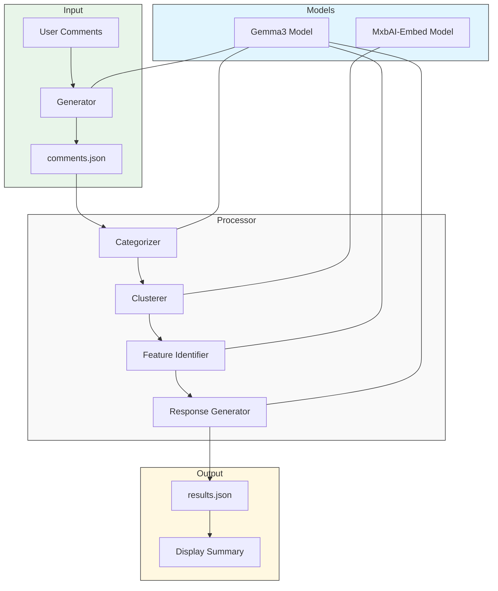
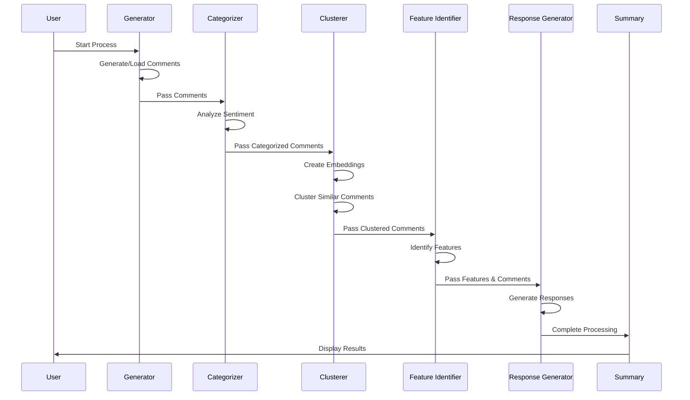

# Comment Processing System

A Node.js application that demonstrates how to use Gemma3 to process user comments about a fictional AI assistant called Jarvis.

## Overview

This system processes user comments through a workflow that:

1. **Generates** synthetic user comments
2. **Categorizes** comments as positive, negative, or neutral
3. **Clusters** similar comments together
4. **Identifies** potential product features based on comment content
5. **Generates** polite responses for each comment

## Tech Stack

- **Runtime**: Node.js (ES Modules)
- **AI Models**: 
  - Gemma3 (via Docker Model Runner) - For text generation and processing
  - MxbAI-Embed-Large - For text embeddings and clustering
- **Dependencies**:
  - OpenAI SDK (v4.90.0) - Used for API interface to the Docker Model Runner
- **Environment**:
  - Docker Desktop with Model Runner extension

## Architecture Diagram



## Project Structure

```
ai-reviewer/
├── src/
│   ├── config.js           # Configuration settings
│   ├── generator.js        # Comment generation logic
│   ├── processor/
│   │   ├── index.js        # Main processor
│   │   ├── categorizer.js  # Comment categorization
│   │   ├── clusterer.js    # Comment clustering
│   │   ├── featureId.js    # Feature identification
│   │   └── responder.js    # Response generation
│   └── utils.js            # Utility functions
├── data/
│   └── comments.json       # Generated comments storage
├── index.js                # Main entry point
├── package.json
└── .nvmrc
```

## Requirements

- Node.js v20.10.0 or later (ES Modules support)
- Docker Desktop v4.40.0 or later (includes Docker Model Runner)
- Hardware Requirements:
  - Minimum 3.4GB VRAM for Gemma3 model
  - Minimum 2.5GB disk space for Gemma3 model

## Installation

1. Clone the repository
2. Install dependencies:
```bash
npm install
```

3. Enable Docker Model Runner and listen on port 12434:
```bash
docker desktop enable model-runner --tcp 12434
```

4. Pull the Gemma3 model:

```bash
docker model pull ai/gemma3
```

5. Pull the embeddings model:

```bash
docker model pull ai/mxbai-embed-large
```

## Usage

Run the application:

```bash
node index.js
```

The application will:

1. Generate synthetic user comments about Jarvis (or use existing ones if available)
2. Process these comments through the workflow
3. Display a summary of the results
4. Save detailed results to `data/results.json`

## Configuration

You can customize the application behavior by modifying `src/config.js`:

- Change the number of comments to generate
- Adjust the Gemma3 model and parameters
- Modify the clustering similarity threshold
- Add or remove comment topics

## How It Works

### Comment Generation

The system uses Gemma3 to generate synthetic user comments about Jarvis, focusing on various aspects like UI, performance, features, etc. These comments are stored in JSON format with metadata.

### Comment Processing

1. **Categorization**: Uses sentiment analysis with Gemma3 to classify comments as positive, negative, or neutral.
2. **Clustering**: Implements embedding-based clustering to group similar comments together, even if they belong to different categories.
3. **Feature Identification**: Extracts potential feature requests or improvements from comment clusters using Gemma3.
4. **Response Generation**: Creates contextually appropriate, polite responses for each comment.

## Data Flow



## Example Output

The system generates a summary that includes:

- Comment category distribution
- Number of clusters found
- Identified features with priority levels
- Sample comments and responses

Detailed results are saved to `data/results.json` for further analysis.
